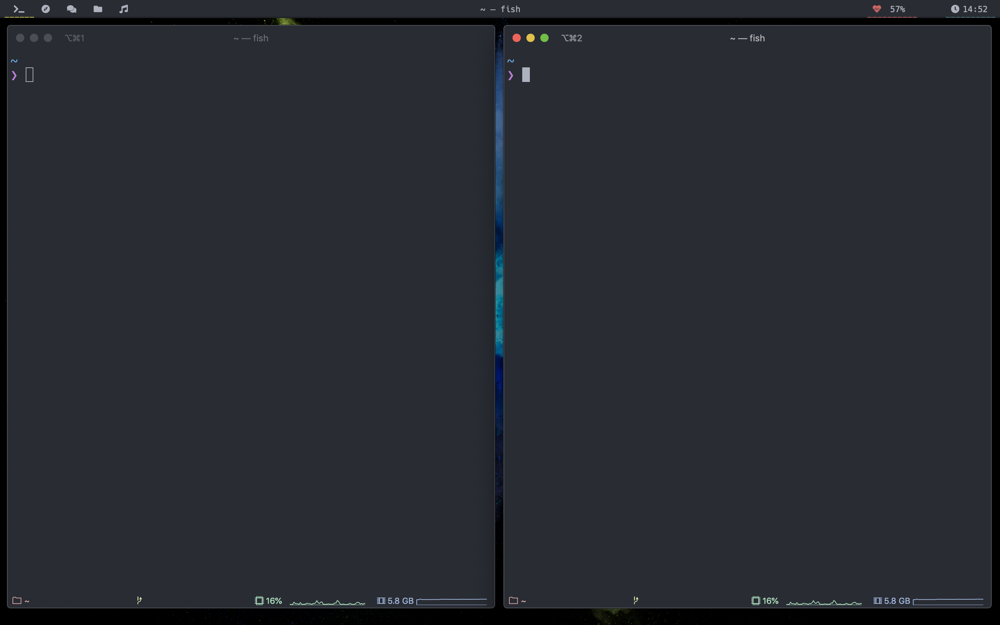

# dotfiles
Dotfiles for Neovim, iTerm2, Fish, etc.



## Installation

macos
```bash
git clone https://github.com/bergholmm/dotfiles.git ~/dotfiles
cd ~/dotfiles
./install_macos.bash
```

linux
```bash
git clone https://github.com/bergholmm/dotfiles.git ~/dotfiles
cd ~/dotfiles
./install_linux.bash
```

## Linking files

Only link dotfiles (fish shell required):
```bash
cd ~/dotfiles
./linkfiles.fish
```

Only install nvim plugins:

```bash
nvim +PluginInstall +qall
```

## TODOs
```
[x] Setup linux installer
[ ] Setup prettier rules
```
